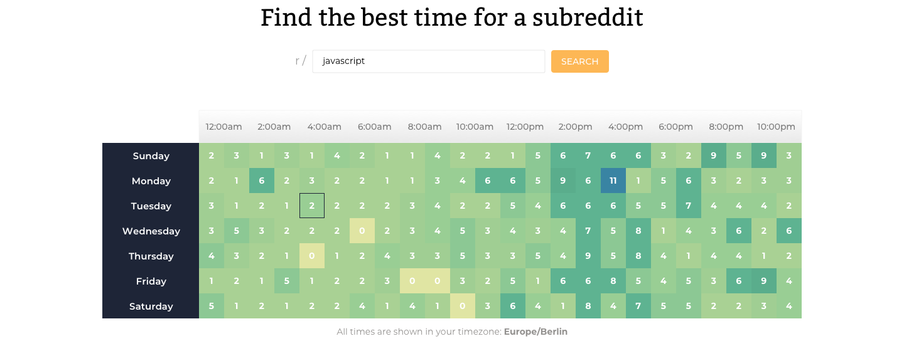

#Reddit Timer App

The Reddit Timer app is an app that will tell you the best times to post on Reddit based on last year's data for a given Subreddit.



##About this project

In an effort to familiarize myself with a professional real-world development environment, I decided to take up this project, offered as a course at [ooloo.io](https://ooloo.io/). In this project, designs were provided via [Figma](https://figma.com). The project was split in several tasks in order to simulate a team environment. The tasks were provided via a kanban style board through [ClickUp](https://clickup.com). I was exposed to the following techniques:

-   **Creating pixel-perfect designs**
-   **Planning and implementing a complex UI Component**
-   **Working with RESTful APIs**
-   **Professional Git workflow with pull requests**
-   **Code Reviews**

Additionally, **continuous integration** and **testing** are also a part of the project, which I plan to integrate in the near future.

###Tools & Tech Stack

-   [React](https://reactjs.org/)
-   [Styled Components](https://styled-components.com/)
-   [ClickUp](https://clickup.com) - project management
-   GitHub - version control and code reviewing
-   Slack - communication tool

### Install

```sh
yarn install
```

### Usage

```sh
yarn start
```

### Run tests

```sh
yarn test
```

##What I would add/change in this project

-   Integrating tests
-   Further splitting of the Heatmap table into smaller components

*   Testing for cross-browser support and app performance
*   Making the app fully responsive
